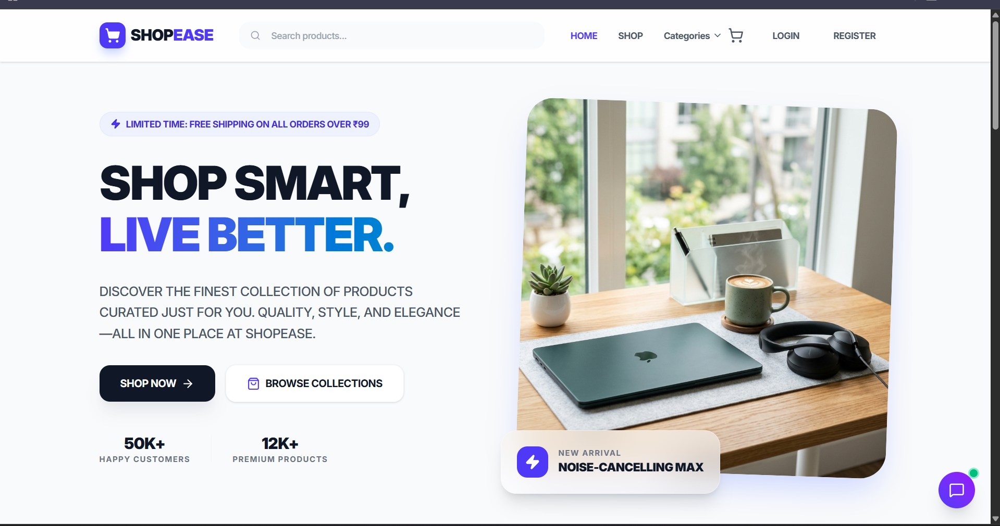
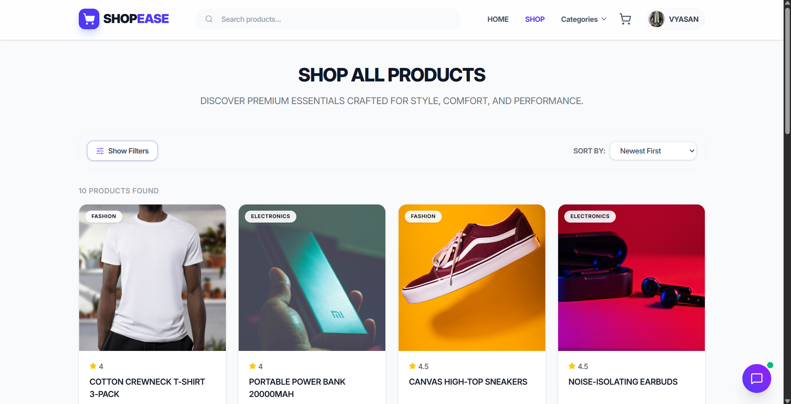
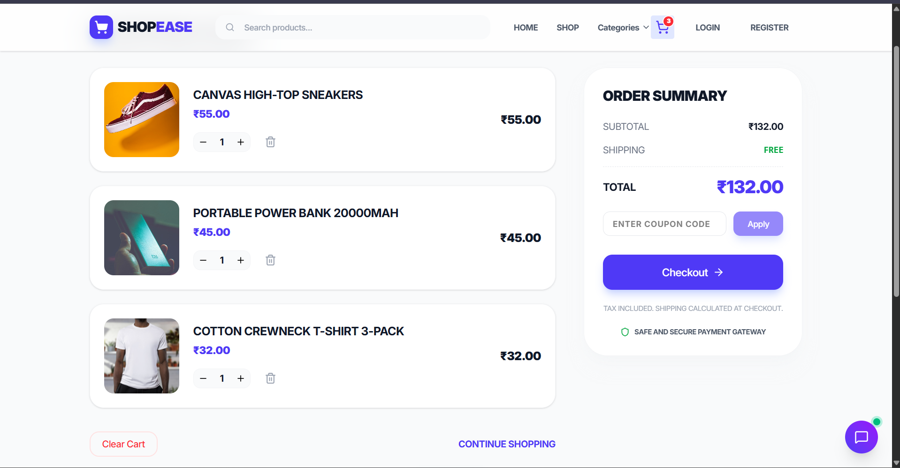
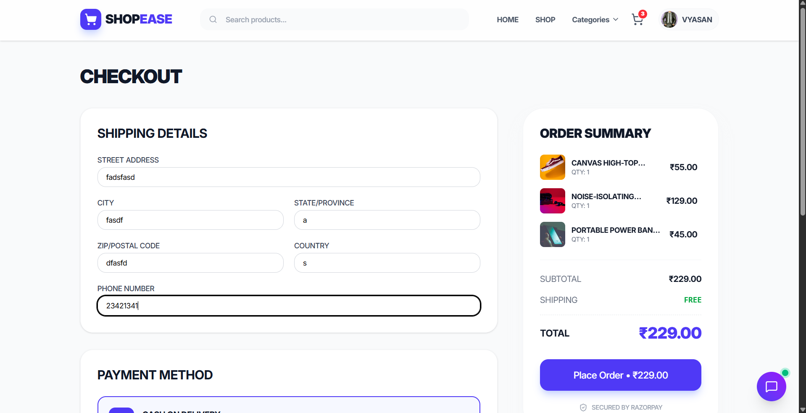
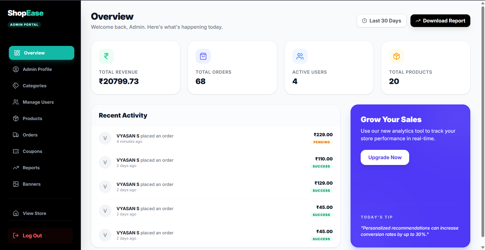
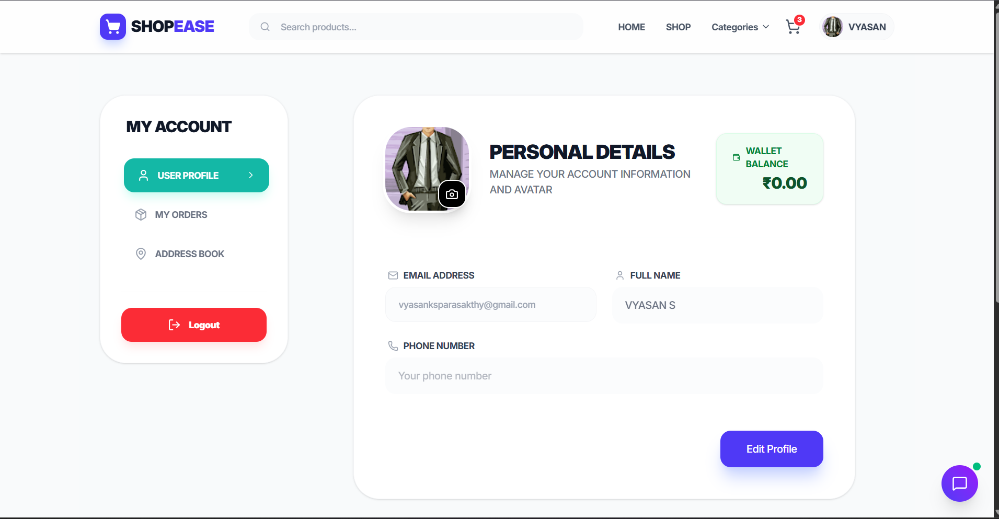
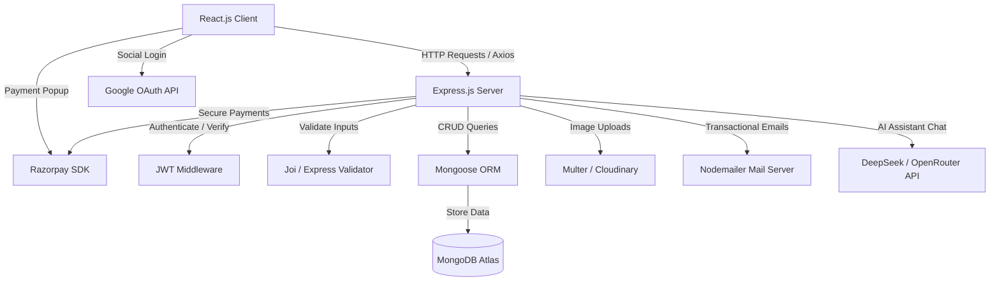

# 🌌 ShopEase – Full Stack MERN E-Commerce Platform

[](https://react.dev)
[](https://tailwindcss.com)
[](https://redux-toolkit.js.org)
[](https://nodejs.org)
[](https://expressjs.com)
[](https://www.mongodb.com)
[](https://opensource.org/licenses/MIT)

A premium, full-stack e-commerce platform that enables users to browse products, manage carts, securely place orders, and allows administrators to manage inventory, orders, and customers.

---

## 🔗 Live Demo

*   **Frontend Client:** [Deploy Link](https://shopease-frontend-vyasan.s3-website-us-east-1.amazonaws.com) *(Update with your production URL)*
*   **Backend API Service:** [Backend Link](https://shopease-ecom-2dhd.onrender.com/api) *(Update with your production URL)*

---

## 📸 Screenshots

Here is a visual tour of the platform. You can replace the placeholder paths below with your screenshots.

<div align="center">

### 🏠 Home Page
*(Featured Carousel, Categories, Top Deals, and DeepSeek Chatbot interface)*
<!-- TODO: Add your home page screenshot in the path below -->


### 🛍️ Product Catalog & Search
*(Dynamic filtering, search, pagination, and sorting)*
<!-- TODO: Add your product page screenshot in the path below -->


### 🛒 Shopping Cart & Checkout
*(Item adjustments, real-time total, coupon validation, and wallet integration)*
<!-- TODO: Add your cart screenshot in the path below -->


### 💳 Razorpay Secure Payment Portal
*(Seamless checkouts with Razorpay popup)*
<!-- TODO: Add your checkout screenshot in the path below -->


### 📊 Admin Dashboard
*(Sales analytics, inventory status, user metrics, and order progression)*
<!-- TODO: Add your admin dashboard screenshot in the path below -->


### 📜 Order History & Wallet
*(Past transactions, delivery statuses, invoice summary, and wallet balance updates)*
<!-- TODO: Add your order history screenshot in the path below -->


</div>

---

## 🛠️ Tech Stack

### 💻 Frontend
*   **Core:** React.js (v19) with Vite
*   **Routing:** React Router (v7)
*   **State Management:** Redux Toolkit & React-Redux
*   **Styling:** Tailwind CSS (v4) for premium look and responsiveness
*   **Forms:** React Hook Form & Yup/Joi validation
*   **HTTP Client:** Axios for API requests
*   **UI Components:** Lucide React, Swiper.js, SweetAlert2, React Toastify

### ⚙️ Backend
*   **Runtime:** Node.js
*   **Framework:** Express.js (v5)
*   **Database:** MongoDB & Mongoose ORM
*   **Authentication:** JSON Web Tokens (JWT) & Google OAuth
*   **Security:** Helmet, CORS, Express Rate Limit
*   **File Uploads:** Multer & Multer Cloudinary Storage
*   **Logging:** Winston & Winston Daily Rotate File

### 💳 Payments & Integrations
*   **Payment Gateway:** Razorpay SDK Integration
*   **AI Chatbot Assistant:** DeepSeek AI integration via OpenRouter API
*   **Mail Service:** Nodemailer (Gmail SMTP setup)

### 📦 Cloud Storage
*   **Images:** Cloudinary for products, categories, and promotional banners

---

## 🌟 Key Features

### 👤 Customer Features
*   **Authentication & Identity:**
    *   Secure email-based signup/login with Bcrypt hashing.
    *   OTP verification via email for password resets.
    *   One-click Social Login with Google OAuth.
*   **Product Experience:**
    *   Full-text search, multi-category filters, sorting (price, relevance), and pagination.
    *   Dynamic swiper-based home page banner sliders.
*   **Cart & Checkout:**
    *   Persisted shopping cart sync with database.
    *   Coupon system applying real-time order discounts.
    *   Integrated Digital Wallet to add funds and checkout directly.
    *   Integrated Razorpay payment portal for credit/debit card, UPI, and net banking.
*   **AI Support Bot:**
    *   AI Chatbot assistant powered by DeepSeek to answer product questions or help navigate.

### 🛡️ Admin Dashboard & CRUD Management
*   **Insights:** Core analytics charts showing revenue, orders count, and inventory warnings.
*   **Product Catalog:** Full CRUD operations on products (with automated Cloudinary image uploads).
*   **Category management:** Add/edit/delete categories.
*   **Banners & Promotion:** Manage active promotional banners.
*   **Order Fulfillment:** Track and update order delivery statuses (Pending, Shipped, Delivered, Cancelled).
*   **User Admin:** Monitor registered accounts and modify authorization levels.

---

## 💡 Technical Highlights

*   **Role-Based Access Control (RBAC):** Distinct route-protection middleware and distinct JWT secrets (`JWT_USER_SECRET` and `JWT_ADMIN_SECRET`) to separate Customer and Admin access levels.
*   **Custom Rate Limiter:** Applied limiters on auth routes (`/api/auth`) to prevent brute force attacks.
*   **Robust Error Handling:** Global Express error-handling middleware coupled with React Error Boundaries on the client to avoid service interruption.
*   **Database Aggregations:** MongoDB pipeline operations for admin analytics and inventory counts.
*   **Production-Ready Logging:** Winston logger configurations maintaining logs separated into `/logs/error-%DATE%.log` and `/logs/combined-%DATE%.log` with daily automatic rotation.
*   **Graceful Shutdown:** Node.js process listeners catching SIGTERM/SIGINT signals to close HTTP servers and disconnect MongoDB cleanly.

---

## 📐 Architecture & Flow



### Development Architecture Patterns
*   **MVC Design Pattern:** Separation of concerns using routing layers, model representations, and controller business logic.
*   **REST API Standards:** Consistent JSON payloads, correct HTTP response status codes, and standard HTTP verb usages.

---

## 📁 Project Folder Structure

```text
ShopEase-Ecomm/
├── client/                      # React Frontend codebase (Vite setup)
│   ├── src/
│   │   ├── assets/              # Static assets & logos
│   │   ├── components/          # Reusable components
│   │   │   ├── admin/           # Admin panel subcomponents
│   │   │   ├── auth/            # Authenticated route wrappers
│   │   │   ├── common/          # Global Navbar, Footer, Loader
│   │   │   ├── home/            # Homepage sections & banners
│   │   │   ├── layout/          # Page layouts
│   │   │   ├── shop/            # Catalog grids and product cards
│   │   │   └── user/            # Customer profile components
│   │   ├── config/              # Axios configurations
│   │   ├── constants/           # Action types and API endpoints
│   │   ├── hooks/               # Custom hooks
│   │   ├── pages/               # Page views (Auth, Shop, Admin, Wallet)
│   │   ├── redux/               # Redux Toolkit slices (Cart, Auth, UI)
│   │   ├── routes/              # Client-side React Router routes
│   │   ├── services/            # API call modules
│   │   └── utils/               # Formatting, storage helpers
│   ├── package.json
│   └── tailwind.config.js
│
├── server/                      # Node.js Express Backend codebase
│   ├── config/                  # Database connections & system configurations
│   ├── controllers/             # Request handlers / Controller layer
│   ├── middlewares/             # JWT, rate limiters, error handlers
│   ├── models/                  # Mongoose MongoDB schemas
│   ├── routes/                  # Express route declarations (APIs)
│   ├── scripts/                 # Database seed scripts
│   ├── services/                # Auxiliary business logic modules
│   ├── utils/                   # Winston logger & email utility templates
│   ├── validation/              # Joi validation rules
│   ├── server.js                # Core Server Entrypoint (OOP class based)
│   └── package.json
```

---

## 📡 API Endpoints Overview

| Method | Endpoint | Description | Access |
| :--- | :--- | :--- | :--- |
| **POST** | `/api/auth/register` | Register a new customer account | Public |
| **POST** | `/api/auth/login` | Login user & return user token | Public |
| **POST** | `/api/auth/google` | Google OAuth Authentication | Public |
| **GET** | `/api/products` | Retrieve products (with sorting/paging) | Public |
| **GET** | `/api/products/:id` | Fetch specific product detail | Public |
| **POST** | `/api/admin/products` | Create a new product (with Cloudinary) | Admin |
| **PUT** | `/api/admin/products/:id` | Edit details of an existing product | Admin |
| **GET** | `/api/cart` | Get current user's cart | Customer |
| **POST** | `/api/cart/add` | Add product item to cart | Customer |
| **POST** | `/api/orders` | Place a new order | Customer |
| **GET** | `/api/orders/history` | Retrieve user's order history | Customer |
| **POST** | `/api/payment/create-order`| Generate Razorpay order ID | Customer |
| **POST** | `/api/chatbot` | Fetch assistant responses from AI bot | Customer |

---

## 🔧 Installation & Local Setup

### 1. Clone the Repository
```bash
git clone https://github.com/yourusername/shopease-ecomm.git
cd shopease-ecomm
```

### 2. Configure Backend Server
1. Navigate to the server folder:
   ```bash
   cd server
   ```
2. Install server-side dependencies:
   ```bash
   npm install
   ```
3. Create a `.env` file in the root of the `server/` directory and configure the variables (see template below).
4. Run the seeders to populate initial database records:
   ```bash
   # Seeds category items
   npm run seed_categories
   
   # Seeds promotional banner data
   npm run seed_banners
   ```

### 3. Configure Frontend Client
1. Navigate to the client folder:
   ```bash
   cd ../client
   ```
2. Install client-side dependencies:
   ```bash
   npm install
   ```
3. Create a `.env` file in the root of the `client/` directory and set the API endpoint (see template below).

---

## 🔒 Environment Variables Configuration

### Backend variables (`server/.env`)
Create a `.env` inside `/server` directory:
```env
# Server Configuration
PORT=5000
NODE_ENV=development

# Database Configuration
MONGODB_URI=mongodb://localhost:27017/ShopEase_Ecomm

# JWT Secrets
JWT_USER_SECRET=your_jwt_user_secret_key
JWT_ADMIN_SECRET=your_jwt_admin_secret_key
JWT_EXPIRES_IN=8d

# Nodemailer SMTP Configuration
SMTP_HOST=smtp.gmail.com
SMTP_PORT=465
SMTP_USER=your_smtp_email@gmail.com
SMTP_PASS=your_smtp_app_password
EMAIL_FROM=your_smtp_email@gmail.com

# Admin Default Credentials (for seeding)
ADMIN_NAME=Super Admin
ADMIN_EMAIL=admin@example.com
ADMIN_PASSWORD=StrongPassword123

# Cors Configurations
FRONTEND_URL=http://localhost:5173

# Cloudinary Setup
CLOUDINARY_CLOUD_NAME=your_cloudinary_cloud_name
CLOUDINARY_API_KEY=your_cloudinary_api_key
CLOUDINARY_API_SECRET=your_cloudinary_api_secret

# Razorpay Configuration
RAZORPAY_KEY_ID=your_razorpay_key_id
RAZORPAY_KEY_SECRET=your_razorpay_key_secret

# Google OAuth Configuration
GOOGLE_CLIENT_ID=your_google_client_id
GOOGLE_CLIENT_SECRET=your_google_client_secret

# DeepSeek Chatbot API Integration
OPENROUTER_API_KEY=your_openrouter_api_key
```

### Frontend variables (`client/.env`)
Create a `.env` inside `/client` directory:
```env
VITE_SOCKET_URL=http://localhost:5000
VITE_API_URL=http://localhost:5000/api
VITE_RAZORPAY_KEY_ID=your_razorpay_key_id
VITE_RAZORPAY_KEY_SECRET=your_razorpay_key_secret
VITE_GOOGLE_CLIENT_ID=your_google_client_id
VITE_GOOGLE_CLIENT_SECRET=your_google_client_secret
```

---

## 🚀 Running the Project

### Start Backend Service
From the `server/` directory:
```bash
# Starts the server in development mode using Nodemon
npm run dev

# Starts the server in production mode
npm start
```

### Start Frontend Client
From the `client/` directory:
```bash
# Starts Vite development server
npm run dev

# Compiles production bundles
npm run build
```

---

## 💪 Challenges Faced & Solutions

*   **Handling Dual Authorization Contexts (User vs Admin):**
    *   *Challenge:* Admin operations require strict validations separate from customers. Placing all users under one JWT secret can lead to role-escalation exploits.
    *   *Solution:* Implemented two discrete secret key signatures (`JWT_USER_SECRET` and `JWT_ADMIN_SECRET`). The login controllers verify roles and sign corresponding tokens, while route middlewares selectively inspect the tokens relative to the resource scope.
*   **Razorpay Payment Verification Security:**
    *   *Challenge:* Ensuring transaction records are only updated when actual payments succeed on Razorpay's end, avoiding clients falsifying successful callbacks.
    *   *Solution:* Employed Razorpay's SHA256 signature verification. When checkout finishes on the UI, the frontend posts the payload containing `razorpay_payment_id`, `razorpay_order_id`, and `razorpay_signature` to the backend. The backend computes the HMAC hash using the stored `RAZORPAY_KEY_SECRET` and updates database states only on a match.
*   **Express 5 Middleware Migrations:**
    *   *Challenge:* Migrating asynchronous route error trapping in Express v5 while preventing unhandled promise rejections.
    *   *Solution:* Integrated uncaughtException and unhandledRejection system listeners globally on server boot, combined with custom middleware error traps to clean up resource states on crash loops.

---

## 📈 Learning Outcomes

Through building **ShopSphere**, I gained hands-on expertise with:
*   Designing and implementing secure REST APIs following the MVC schema.
*   Authenticating routes using JSON Web Tokens (JWT) and social OAuth integrations.
*   Designing and scaling relational structures using MongoDB and Mongoose.
*   Handling live payment transactions securely via SDKs and webhooks.
*   Structuring clean react states with Redux Toolkit for complex cart, authorization, and UI toggles.
*   Leveraging Cloudinary for serverless media storage.

---

## 🔮 Future Improvements

- [ ] **AI-Powered Search & Recommendations:** Integrate neural vector search to provide product suggestions based on user shopping behaviors.
- [ ] **Email Notifications & Newsletters:** Automate promotional emails and cart abandonment reminders.
- [ ] **PWA Support:** Convert the storefront into a Progressive Web App for offline browsing and fast caching.
- [ ] **Multi-vendor Support:** Open up product creation dashboards for verified sellers with automated commission distributions.
- [ ] **Wishlist Sharing:** Allow consumers to bundle wishlist items and share them on social media channels.

---

## 📄 License

This project is licensed under the MIT License. See the [LICENSE](LICENSE) file for more information.
